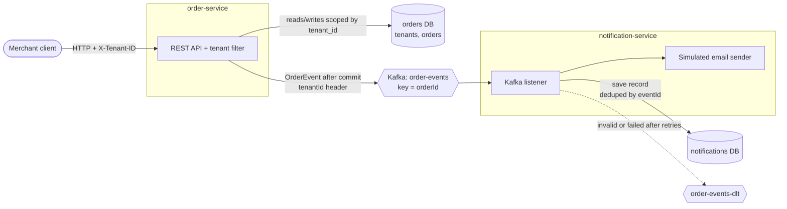
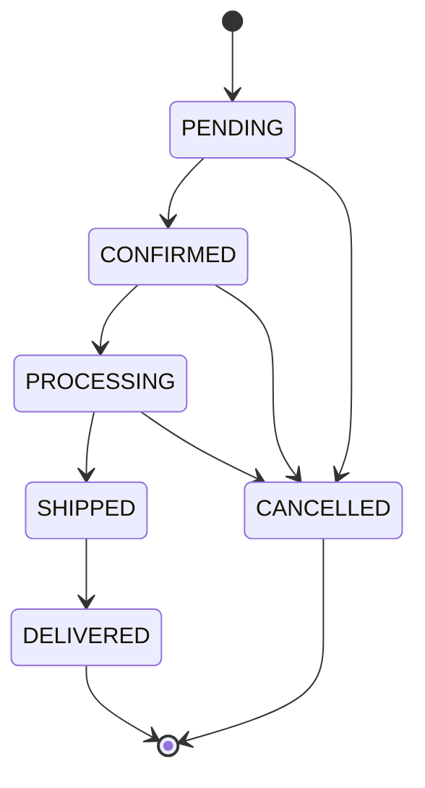

# microservices-assessment-jacob-hubbard

## Overview
I've built two Spring Boot microservices for a hypothetical multi-tenant ecommerce platform. 
The Order Service is responsible for handling each merchant's orders (creating, updating, and cancelling). 
The Order Service will publish events throughout each order's lifecycle that the Notification Service will listen for and simulate publishing notifications that a tenant's customer would receive.

## Running it

```bash
docker compose up -d
```
Everything runs on the ports below:
- order-service: `http://localhost:8081`
- notification-service: `http://localhost:8082` (no HTTP API, just health checks)
- Kafka UI: `http://localhost:8080`
- order-db: `localhost:15432`
    - database `orders`, user `postgres`
- notification-db: `localhost:15433`
    - database `notifications`, user `postgres`


#### Seeded tenants:

| Tenant | ID | Status |
|---|---|---|
| Jake's Junk | `11111111-1111-1111-1111-111111111111` | Active |
| Steve's Shoes | `22222222-2222-2222-2222-222222222222` | Active |
| Closed Shop | `33333333-3333-3333-3333-333333333333` | Suspended |
### Tests
From the repo root (Docker must be running for Testcontainers):

```bash
./mvnw test
```

## Architecture & Design



### DB Schemas


### Service communication

* **Order Service:** Exposes HTTP CRUD endpoints for an external system to interface with to create, update, and cancel ecommerce orders for each tenant within the platform.
    * Whenever an order is created, updated, or reached a completed state, it publishes an event to a Kafka topic.
    * I chose a REST API for interfacing with this service because it's a well adopted standard for clients. Since the scope of this service is primarily CRUD operations, REST API makes the most sense here as it allows for the easiest compatibility with infrastructure and clients.
    * I ruled out GraphQL since there's no need for multiple clients to view aggregated data from this service and there would be unnecessary overhead.
    * I ruled out gRPC since it's primarily for service-to-service calls needing high throughput, but this Order Service might be called by frontend clients. It would add too much complexity and is unnecessary for this use case.
* **Notification Service:** Consumes the order events and decides what notification applies based on the event type. It then simulates sending a customer facing notification and saves a record of it in its DB.
    * I chose Kafka as a log model over a traditional message broker seemed to fit better for this assignment. Order events stay on the topic after they're consumed, so the Notification Service can catch up or replay them, and keying events by order id keeps each order's events in order.
* Both services don't directly call each other so if the Order Service is down, then it doesn't necessarily halt previous notifications from being picked up via Kafka and processed by the Notification Service.

### Multi-tenancy
* The isolation model I chose for multi-tenancy is a shared DB schema that is scoped by a Tenant Id field that would act as a filter of sorts to ensure separation of data between tenants
* I decided against schema- or database-per-tenant isolation models because an e-commerce platform like this would likely have lots of smaller merchants, and those approaches multiply migrations, connection pools, and operational overhead with every new tenant.
* If there were larger enterprise tenants that require stronger isolation or compliance needs, then I would consider moving to a hybrid model for those specific tenants (DB or schema per tenant)

#### How Tenant Isolation is enforced:
1. A request filter reads the tenant ID from an `X-Tenant-ID` header and checks it against the tenants table. Incorrect ids are rejected with a 400, and unknown or suspended tenants with a 403
2. There's a tenant context thread that will get set from a filter and services will use it instead of using a tenant from a request body 
3. The Hibernate ORM's `@TenantId` annotation is used to scope every query and insert to the current tenant derived from the context
4. Every order has a foreign key to the tenants table, and indexes lead with `tenant_id`, since nearly every query filters on it
5. Events carry the tenant id in a Kafka header and the consumer sets its tenant context before touching its DB
6. Cross tenant HTTP requests will return a 404 not found

> The `X-Tenant-ID` header is client-supplied, so any caller can claim any valid tenant.
> It stands in for a tenant claim in something like a validated JWT. Tenant resolution is isolated in one filter, so switching to token-based auth wouldn't change anything downstream.

### Tenant context
* A request filter reads the header and stores the tenant ID in a ThreadLocal-based `TenantContext`, which is cleared at the end of each request
* Hibernate reads the tenant from `TenantContext` through a `CurrentTenantIdentifierResolver`, so `@TenantId` scopes every query and insert. If no tenant is set, the resolver returns a placeholder that matches no data, so a missing tenant can never read or write real rows.
* When the Order Service publishes an event, the Tenant Id is sent as a Kafka header
* The Notification Service reads that header, checks it matches the tenant ID in the payload, sets its own `TenantContext`, and Hibernate scopes its writes the same way

### Failure handling
* Kafka is down: the order change still commits, but its event is lost since there's no outbox yet (see [What's incomplete](#whats-incomplete))
* Event keeps failing: retried 3 times, one second apart, then sent to `order-events-dlt`. If malformed events get picked up (missing or mismatched tenant header, unparseable payload), then skip the retries and go straight there
* Duplicate event: skipped using a unique event ID
* Event keeps failing: retried a few times, then sent to a dead-letter topic
* Two updates to the same order at once: optimistic locking, second request gets a 409
* Invalid status change (cancelling a shipped order): 409 with an error message

### Patterns used
* **Event-driven communication (Kafka):** services are decoupled, so Order Service works even if the Notification Service is down. Ruled out synchronous REST calls between services (tight coupling) and ActiveMQ (messages are removed once consumed).
* **Database per service:** each service has its own Postgres instance and owns its schema. Ruled out a shared database, which couples services through their tables.
* **Shared-schema multi-tenancy:** tenant filtering is automatic instead of handwritten in every query. Ruled out schema- and database-per-tenant (operational overhead per tenant).
* **Publish-after-commit:** events only go out if the order change commits. Ruled out sending inside the transaction (phantom events). A transactional outbox would close the remaining gap (see [What's incomplete](#whats-incomplete))
* **Idempotent consumer:** Kafka delivers at least once, so duplicates are skipped using a unique event ID. Ruled out relying on exactly-once delivery, which doesn't cover the database write.
* **Retry with dead-letter topic:** failing messages are retried, then moved aside so they don't block the partition. Ruled out retrying forever or silently dropping them.
* **Optimistic locking (`@Version`):** concurrent updates to the same order are detected instead of overwritten. Ruled out pessimistic locking, which holds database locks and hurts throughput.
* **Flyway migrations:** versioned, plain-SQL schema changes. Ruled out Hibernate `ddl-auto`, which isn't safe for production, and Liquibase, whose database-agnostic changelogs and rollback features aren't needed when targeting only Postgres. Plus I've used Flyway before and plain SQL is easier to review in my opinion.
* **Testcontainers for integration tests:** tests run against real Postgres and Kafka. Ruled out H2, which behaves differently from Postgres and `@EmbeddedKafka` which is lighter, but I preferred one consistent approach for both dependencies.

### Production readiness
* **Security**
* I'd do something like replace the `X-Tenant-ID` header with a tenant claim from a validated JWT
* I'd add Postgres row-level security on `tenant_id` as a second layer under the Hibernate filter
* Kafka would need to be secured and I'd use TLS for Postgres
* I'd use a secrets manager for credentials instead of Compose or env files

**Resilience**
* I'd implement a transactional outbox for guaranteed event delivery
* Implementation of tooling to inspect and replay events from the dead-letter topic would be wise

**Observability**
* I'd add distributed tracing, with trace context passed through Kafka headers so one order can be followed across both services
* I'd add improved, structured logs with tenant ID, order ID, and trace ID on every line
* Metrics and alerts would be added

**Scalability**
* I'd likely cache tenant status briefly instead of hitting the database on every request
* Both services are stateless, so they scale horizontally. Consumers would scale up to the topic's partition count

**Deployment**
* I'd use Spring profiles per environment (local, dev, pre-prod, prod)
* I'd create Helm charts and infrastructure setup, with Actuator liveness/readiness probes
* I'd build out CI/CD pipeline with tests, coverage, dependency and image scanning, then promotion through environments
* I'd deploy managed database instances (like AWS RDS) for the services, with backups


## Order lifecycle

| Current status | Allowed next statuses | Cancellable? | Terminal? |
|---|---|---|---|
| `PENDING` | `CONFIRMED`, `CANCELLED` | Yes | No |
| `CONFIRMED` | `PROCESSING`, `CANCELLED` | Yes | No |
| `PROCESSING` | `SHIPPED`, `CANCELLED` | Yes | No |
| `SHIPPED` | `DELIVERED` | No | No |
| `DELIVERED` | none | No | Yes |
| `CANCELLED` | none | No | Yes |

> NOTE: Cancellation only goes through the cancel endpoint, so every cancellation can carry a reason

## API

All requests require an `X-Tenant-ID` header with a seeded tenant ID. Errors use the Problem Details format (RFC 9457).

### order-service

| Method | Path | Description | Success |
|---|---|---|---|
| `POST` | `/api/v1/orders` | Create an order | `201 Created` |
| `GET` | `/api/v1/orders/{orderId}` | Get an order | `200 OK` |
| `GET` | `/api/v1/orders?page=0&size=20` | List the tenant's orders, newest first | `200 OK` |
| `PATCH` | `/api/v1/orders/{orderId}/status` | Move an order to its next status (use `/cancel` to cancel) | `200 OK` |
| `POST` | `/api/v1/orders/{orderId}/cancel` | Cancel an order, with an optional reason | `200 OK` |

| Status | When |
|---|---|
| `400` | Invalid request body, or missing/malformed `X-Tenant-ID` |
| `403` | Unknown or suspended tenant |
| `404` | Order doesn't exist for this tenant |
| `409` | Invalid status transition, or a concurrent update to the same order |

### notification-service

No HTTP API. To see notification records, run this DB query against the notifications DB:

```bash
docker compose exec notification-db psql -U postgres -d notifications \
  -c "SELECT type, order_status, recipient, message, sent_at FROM notifications ORDER BY sent_at;"
```

To watch notifications being sent as the Notification Service consumes the Kafka messages, follow the service's logs in another terminal with:
```bash
docker compose logs -f notification-service
```
Or if you want to filter by just the simulated notification logs:
```bash
docker compose logs -f notification-service | grep "Simulated"
```

### How to Use Order Service API

Set this `TENANT` variable in your shell to make copy-pasting the curl commands easier. Or just add the applicable Tenant Id to the header from seeded Tenants table. See [Seeded Tenants](#seeded-tenants)
```bash
TENANT=11111111-1111-1111-1111-111111111111
```
### Create an order
```bash
curl -X POST http://localhost:8081/api/v1/orders \
  -H "Content-Type: application/json" \
  -H "X-Tenant-ID: $TENANT" \
  -d '{
        "customerId": "aaaaaaaa-aaaa-aaaa-aaaa-aaaaaaaaaaaa",
        "customerEmail": "jane@example.com",
        "currency": "USD",
        "totalAmount": 49.99
      }'
```
**Example Response**
```bash 
HTTP/1.1 201
Location: /api/v1/orders/7396545c-f986-4110-a953-e2603936c957
Content-Type: application/json
Transfer-Encoding: chunked
Date: Tue, 29 Sep 2026 22:35:53 GMT

{
    "id": "7396545c-f986-4110-a953-e2603936c957",
    "customerId": "aaaaaaaa-aaaa-aaaa-aaaa-aaaaaaaaaaaa",
    "customerEmail": "jane@example.com",
    "status": "PENDING",
    "currency": "USD",
    "totalAmount": 49.99,
    "cancellationReason": null,
    "createdAt": "2026-09-29T22:35:53.610370Z",
    "updatedAt": "2026-09-29T22:35:53.610384Z"
}
```

Save the `id` for the next requests:
```bash
ORDER_ID=<id from the response>
```

### Get an order

```bash
curl http://localhost:8081/api/v1/orders/$ORDER_ID \
  -H "X-Tenant-ID: $TENANT"
```
**Example Response**
```json
{
    "id": "7396545c-f986-4110-a953-e2603936c957",
    "customerId": "aaaaaaaa-aaaa-aaaa-aaaa-aaaaaaaaaaaa",
    "customerEmail": "jane@example.com",
    "status": "PENDING",
    "currency": "USD",
    "totalAmount": 49.99,
    "cancellationReason": null,
    "createdAt": "2026-09-29T22:35:53.610370Z",
    "updatedAt": "2026-09-29T22:35:53.610384Z"
}
```

### List orders (default page size is 20)
```bash
curl "http://localhost:8081/api/v1/orders?page=0&size=20" \
  -H "X-Tenant-ID: $TENANT"
```

**Example Response**


```json
{
    "orders": [
        {
            "id": "7396545c-f986-4110-a953-e2603936c957",
            "customerId": "aaaaaaaa-aaaa-aaaa-aaaa-aaaaaaaaaaaa",
            "customerEmail": "jane@example.com",
            "status": "PENDING",
            "currency": "USD",
            "totalAmount": 49.99,
            "cancellationReason": null,
            "createdAt": "2026-09-29T22:35:53.610370Z",
            "updatedAt": "2026-09-29T22:35:53.610384Z"
        }
    ],
    "page": 0,
    "size": 20,
    "totalOrders": 1,
    "totalPages": 1
}
```

### Update status
```bash
curl -X PATCH http://localhost:8081/api/v1/orders/$ORDER_ID/status \
  -H "Content-Type: application/json" \
  -H "X-Tenant-ID: $TENANT" \
  -d '{ "status": "CONFIRMED" }'
```
**Example Response** 
```json
{
    "id": "7396545c-f986-4110-a953-e2603936c957",
    "customerId": "aaaaaaaa-aaaa-aaaa-aaaa-aaaaaaaaaaaa",
    "customerEmail": "jane@example.com",
    "status": "CONFIRMED",
    "currency": "USD",
    "totalAmount": 49.99,
    "cancellationReason": null,
    "createdAt": "2026-09-29T22:35:53.610370Z",
    "updatedAt": "2026-09-29T23:05:49.654488Z"
}
```

### Cancel an order (the reason is optional )
```bash
curl -X POST http://localhost:8081/api/v1/orders/$ORDER_ID/cancel \
  -H "Content-Type: application/json" \
  -H "X-Tenant-ID: $TENANT" \
  -d '{ "reason": "Customer changed their mind" }'
```
**Example Response**
```json
{
    "id": "7396545c-f986-4110-a953-e2603936c957",
    "customerId": "aaaaaaaa-aaaa-aaaa-aaaa-aaaaaaaaaaaa",
    "customerEmail": "jane@example.com",
    "status": "CANCELLED",
    "currency": "USD",
    "totalAmount": 49.99,
    "cancellationReason": "Customer changed their mind",
    "createdAt": "2026-09-29T22:35:53.610370Z",
    "updatedAt": "2026-09-29T23:07:18.482105Z"
}
```

### Example Error Responses

**Invalid status transition (409)**
```json
{
  "detail": "Cannot transition order 6dc70984-ccad-47eb-8edd-06808e0089cd from SHIPPED to CANCELLED",
  "instance": "/api/v1/orders/6dc70984-ccad-47eb-8edd-06808e0089cd/cancel",
  "status": 409,
  "title": "Invalid status transition",
  "orderId": "6dc70984-ccad-47eb-8edd-06808e0089cd",
  "currentStatus": "SHIPPED",
  "requestedStatus": "CANCELLED"
}
```

**Invalid request content (400)**
```json
{
  "detail": "Invalid request content.",
  "instance": "/api/v1/orders",
  "status": 400,
  "title": "Bad Request"
}
```

**Tenant access denied (403)**
```json
{
  "detail": "Tenant is not permitted to access this resource",
  "instance": "/api/v1/orders",
  "status": 403,
  "title": "Tenant access denied"
}
```

## Assumptions
**Tenants**
* A tenant is a merchant selling on the platform. Customers and orders belong to exactly one tenant.
* The same person shopping at two merchants is two separate customer records.
* The tenant is identified by an `X-Tenant-ID` header, as a stand-in for a claim in a validated JWT or getting pulled from a request subdomain or url path.
* Tenants are provisioned outside these services. There's no onboarding API.
* An `ACTIVE` tenant can create, update, and cancel orders. A `SUSPENDED` tenant is not allowed access to the Order Service's endpoints.
* Tenant data lives in Order Service's database as a stand-in for a tenant/identity service, which is out of scope.
* The Notification Service trusts the tenant ID on events from the Order Service, which validates tenants at the edge.
* Requests for another tenant's data return 404, so the API doesn't confirm the data exists.

**Customers**
* Customer data is owned outside these services (a customer or identity service). Orders reference customers by Id only.
* The customer's email is captured at checkout and stored on the order as a snapshot.
* Customer Ids aren't verified against another service, since that service is out of scope.

**Orders**
* Product catalog, inventory, pricing, and payment are out of scope. The order total comes in with the create request, and can be $0. Line items aren't modeled.
* Each order uses a single currency formatted in 3 letter code like USD, services don't verify if they are actual currencies. Tax, shipping, and discounts aren't modeled.
* Customer ids are issued by the platform so they're UUIDs like every other platform id. If merchants supplied their own customer references instead, I'd store them as a string.
* Order statuses: `PENDING`, `CONFIRMED`, `PROCESSING`, `SHIPPED`, `DELIVERED`, `CANCELLED`. Orders can be cancelled only while `PENDING`, `CONFIRMED`, `PROCESSING`.
* Orders can be cancelled until they ship. Up to that point the merchant can still stop fulfillment; once goods are with the carrier, undoing the order is a return/refund flow, which is out of scope.
* Status updates are made by the merchant's staff or systems, not by customers. Role-based permissions are out of scope.
* Orders are never deleted; cancellation is a status change.
* After creation, an order only changes "forward" through lifecycle status transitions. Changing items, totals, or customer details after checkout would require payment adjustments and inventory updates, which are out of scope; in a real platform that would be a separate order-edit workflow.

**Notifications**
* Notifications go to customers, sent on behalf of the merchant.
* A receipt is sent when an order is created or updated. A completion acknowledgement is sent when an order reaches a terminal state (`DELIVERED`, `CANCELLED`).
* Sending is simulated: the notification is published as a log to the console and saved with its recipient, content, and timestamp. Email is the only channel.
* Notifications are eventually consistent; a short delay after an order change is acceptable.

**Infrastructure and scope**
* Only the two services are in scope: no API gateway, identity provider, tenant service, or customer service.
* Kafka runs as a single broker without authentication in Docker Compose.
* Volume is low enough that one instance of each service is sufficient for this project.

## Dependencies
#### To run: 
* Docker
* Docker Compose
> Everything else runs in containers.

#### Built with: 
* Java 21
* Spring Boot 4.1.x, 
* PostgreSQL 18, 
* Kafka 4.3.1
* Flyway (DB migrations)
* Maven
* JUnit 5
* Mockito
* Testcontainers

## Tradeoffs
* **Shared schema for tenants:** cheap and simple to run, but isolation depends on the application. A native query or a bug that skips the Hibernate filter could cross tenants.
* **Header instead of JWT for tenant identity:** kept the scope on isolation itself. Resolution lives in one filter, so switching doesn't touch the rest of the code.
* **Publish-after-commit instead of an outbox:** simpler, but an event can be lost if the service crashes between commit and publish.
* **Fixed retries:** simple, but a longer outage like the notifications database being down, sends events to the dead-letter topic quickly instead of waiting it out. Exponential backoff could handle that better.
* **Terminal statuses only get the completion notice,** not a receipt as well, so customers don't get two emails for one status update.
* **ThreadLocal tenant context:** works cleanly with Spring's thread-per-request model, but the tenant has to be passed along manually if work moves to another thread.
* **Cross-tenant requests return 404, not 403:** doesn't reveal that the order exists, but makes a wrong-tenant mistake harder for a client to debug.


## What's incomplete
* Outbox table implementation for the Orders
* End-to-end tests across both services with TestContainers
* Better code and test coverage with additional integration and unit tests for areas like:
    * Concurrent updates to the same order
    * Events not being published when a transaction rolls back
    * Failed events actually landing on the dead-letter topic
* Better request and message validation checks. For example, right now currency in the create order request body is checked by format only, customer IDs aren't verified, and event payloads aren't validated before retries

